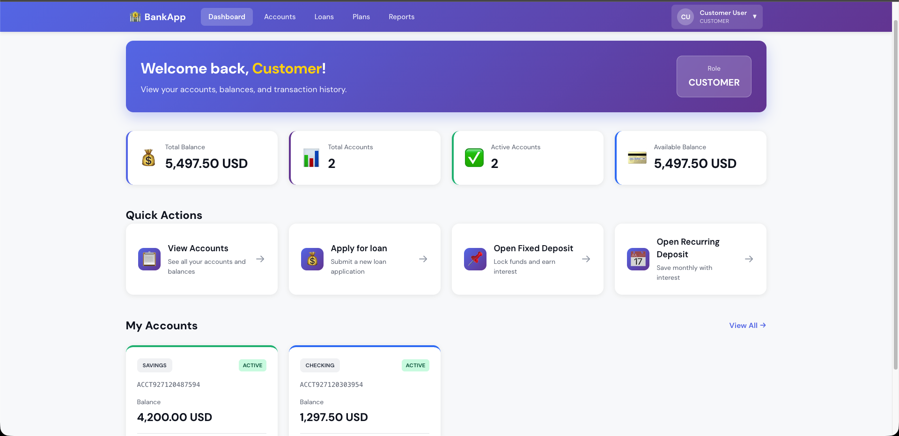
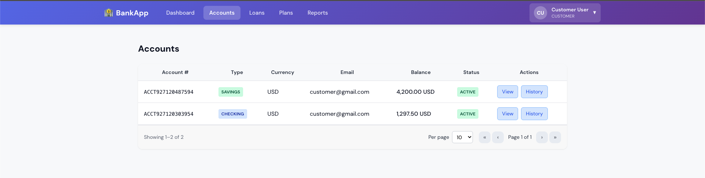
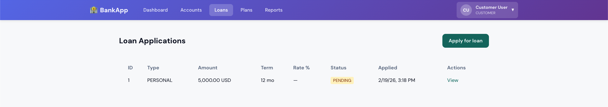
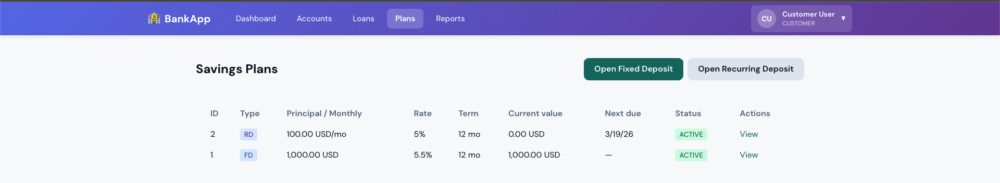
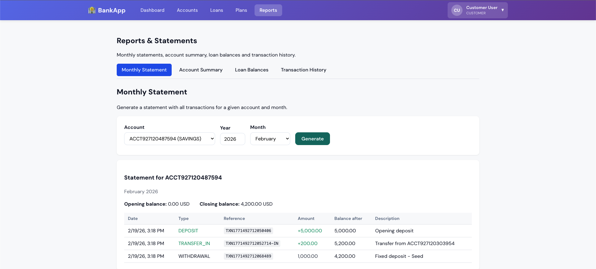

# Bank Management App

Angular frontend + NestJS backend (MySQL, Redis).  
You need **Node.js**, **npm**, and **Docker** installed.

---

## How to run

### Backend (do this first)

```bash
cd backend-nestjs
npm install
cp .env.example .env
docker compose -f docker-compose-dev.yml up -d
npm run prisma:dev:deploy
npm run db:seed
npm run start:dev
```

Backend runs at **http://localhost:3000**.

### Frontend (in a new terminal)

```bash
cd frontend-angular
npm install
npm start
```

Frontend runs at **http://localhost:4200**.

---

## Login

Use any of these (password for all: **12345@aA**):

- **Admin:** admin@gmail.com
- **Employee:** employee@gmail.com
- **Customer:** customer@gmail.com

---

## Useful commands

| Where            | Command            | What it does            |
| ---------------- | ------------------ | ----------------------- |
| backend-nestjs   | `npm run db:reset` | Reset DB and run seed   |
| backend-nestjs   | `npm run test`     | Run backend tests       |
| frontend-angular | `npm run build`    | Build frontend for prod |

**Postman:** Import `backend-nestjs/postman/assignment-tarikul.postman_collection.json`. Base URL: `http://localhost:3000`.

---

## Screenshots

**Auth (login → forgot password → change password → create account)**

1. **Login page**


2. **Forgot password page**


3. **Change password**


4. **Create account page**


5. **Dashboard**



6. **Accounts**



7. **Amount transfer**


8. **Amount withdraw**


9. **Account history**


10. **Apply for loan**


11. **Loan**



12. **Plans**



13. **Open fixed deposit**


14. **Open recurring deposit**


15. **Reports**



16. **Generated report PDF**


